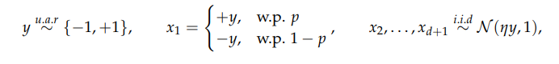

# Review of Robustness May Be at Odds with Accuracy (ICLR 2019)
From [1], Dimitris et al. emphasize the trade-off between robustness and stander accuracy. Leading the reader to understand the trade-off the straightforward binary classification example was been shown.   
In such a sample, the model tries to learn the classification of input-label pairs. Where x1 is moderately correlated to the y, however, can miss. From X_2 to X_d+1 sample from a normal distribution, which means was η time of y. 
  
From a standard accuracy perspective, with weight = [ 0 , 1/d , 1/d , ... ] can return 100% accuracy. Instead of choosing a higher correlated variable, getting small hints from thousand of lower ones can achieve a perfect score, however, this is not what we want.   
Instead of depositing clues from small hints, learning higher correlated variables can lead the model more robust. In that case, the accuracy will drop. Based on the example, Dimitris et al. propose there is a trade-off between robustness and accuracy.  
To understand the robust feature(x1), they apply the PGD attack on both models with and without robustness training. Those standard high-accuracy models can easily be fooled by the picture that humans can't tell the difference. However, when the model with robustness training is fooled, that picture also confuses humans. Moreover, such features are similar to which generated model learned.   
All in all, training for only accuracy is a double-edged sword. It can make the model strong but also brittle. Hence, to make the model robust enough to deal with the noise in real life, training for accuracy is not a good choice.
# reference
[1. Robustness May Be at Odds with Accuracy ICLR 2019](https://openreview.net/forum?id=SyxAb30cY7)